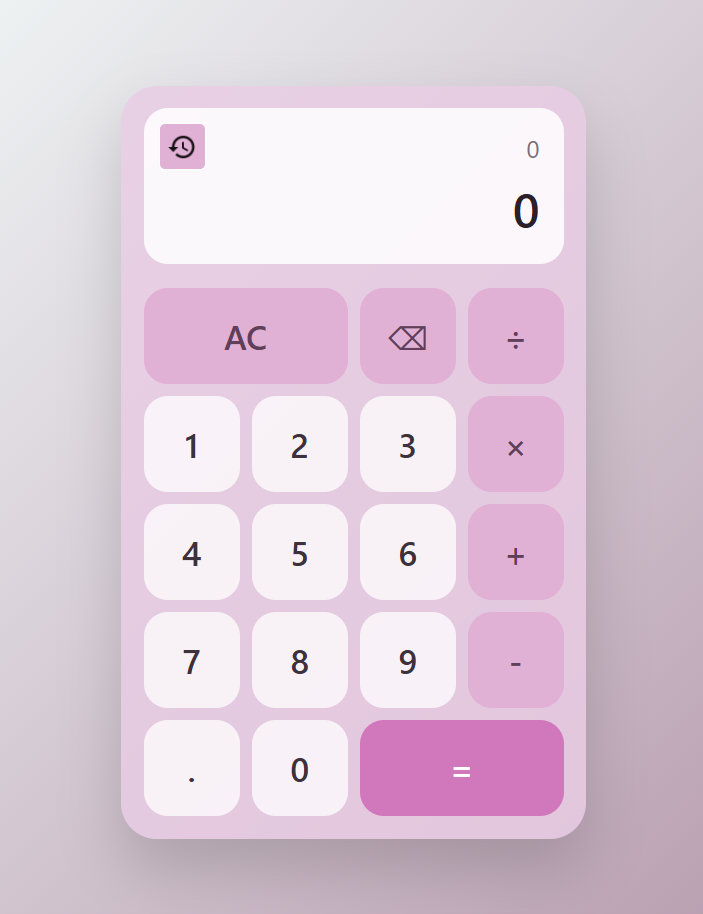

# Calculadora Web con Historial Dinámico

Aplicación web interactiva desarrollada con React y JavaScript. Implementa la lógica completa de una calculadora estándar con gestión de estados mediante hooks, control de errores matemáticos y un panel flotante de historial de operaciones.

---

## Vista Previa



---

## Funcionalidades

- **Operaciones Aritméticas Básicas:** Suma, resta, multiplicación y división.
- **Historial Flotante Dinámico:** Panel desplegable al pasar el cursor (`onMouseEnter` / `onMouseLeave`) que almacena y apila en tiempo real las operaciones calculadas.
- **Formateo de Resultados y Redondeo:** Manejo automático de decimales para evitar desbordamientos visuales mediante redondeo a 4 decimales en operaciones complejas.
- **Control de Errores e Indeterminaciones:** Gestión de casos especiales como división por cero o resultados no finitos (muestra pantalla de `Error` de forma segura).
- **Gestión Avanzada de Entradas:**
  - Control de decimales únicos (impide la introducción de múltiples puntos por número).
  - Borrado completo (`AC`) y borrado carácter por carácter (`⌫`) con recuperación del estado previo.

---

## Conceptos Aplicados

- **Core:** React.js, JavaScript (ES6+), HTML5, CSS3 (Grid y Flexbox).
- **React Hooks:** `useState` (gestión de `valorActual`, `valorAnterior`, `operador`, `historial` y `mostrarHistorial`).
- **Lógica de Estado:** Manipulación de arrays (desestructuración de estado previo) y transformaciones de tipo (`parseFloat`, `toFixed`, `slice`).

---

## Ejecución/Clonación 

1. **Clonar el repositorio:**
   ```bash
   git clone [https://github.com/tuusuario/tu-repositorio.git](https://github.com/tuusuario/tu-repositorio.git)